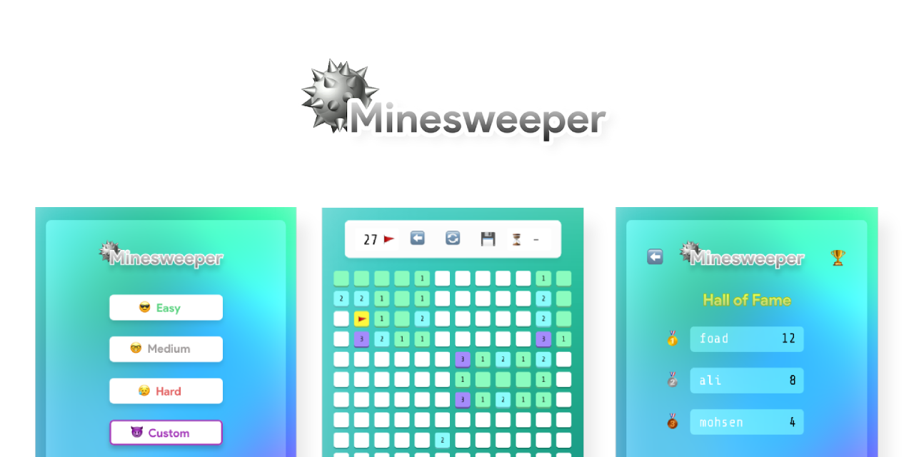

[Video Link](https://www.aparat.com/v/Mc2JN)
# Minesweeper
This game is completely written in C++ with the help of the [SBDL](https://github.com/SBU-CE/SBDL) and [SDL](https://github.com/libsdl-org/SDL) libraries for the graphic part.
> [Commnand-Line version](https://github.com/mfrashidi/minesweeper)
## Installation
> You have to install the SDL2 library before
1. Clone the repository
```bash
git clone https://github.com/mfrashidi/minesweeper-gui.git && cd minesweeper-gui
```
2. Make **lib** and **include** directories
```bash
mkdir lib && mkdir include
```
3. Put *lib* directories of `SDL2`, `SDL2_image`, `SDL2_ttf`, `SDL2_mixer` in the **lib** directory.

4. Put *include* directories of `SDL2`, `SDL2_image`, `SDL2_ttf`, `SDL2_mixer` in the **include** directory.

5. Compile and run the game :rocket:
```bash
make && ./play
```
## Features
- Three basic modes + Custom mode
- Unlimited Users
- Unlimited save slots for each user
- Encrypted save slots to prevent cheating :lock:
- Leaderboard
## Game modes

- **Easy:** 5*5 table, 4 bombs
- **Medium:** 12*12 table, 28 bombs
- **Hard:** 20*20 table, 96 bombs
- **Custom:** 5\*5-20\*20 table, 1-399 bombs, Set time limit for the game

## TODO :white_check_mark:
- [ ] Add other modes to the game
- [ ] Test and Add Windows support

## Contributing
Pull requests are welcome. For major changes, please open an issue first to discuss what you would like to change.

Please make sure to update tests as appropriate.

## License
[APACHE 2.0](https://choosealicense.com/licenses/apache-2.0/)
